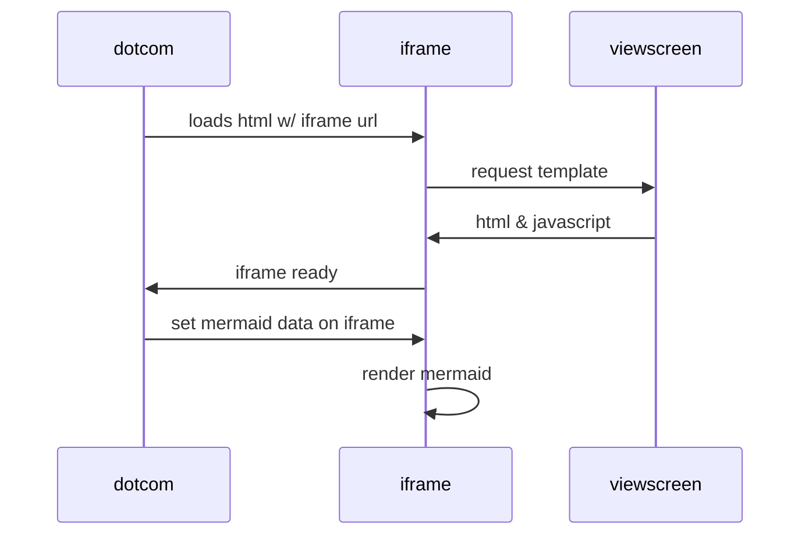

# ilsos-drivers-sapi

 

Drivers System API

This service implements the next specification: https://anypoint.mulesoft.com/exchange/0fa744b1-1284-46c5-b23c-0eb98ea787e3/ilsos-drivers-sapi/minor/1.0/

## Table of contents
1. [Endpoints](#endpoints)

## Endpoints
The service provides the next endpoints:

### PATCH  /v1/drivers
Updates the driver address

The next diagram shows the business sequence of messages or events exchanged between the several backend systems.

