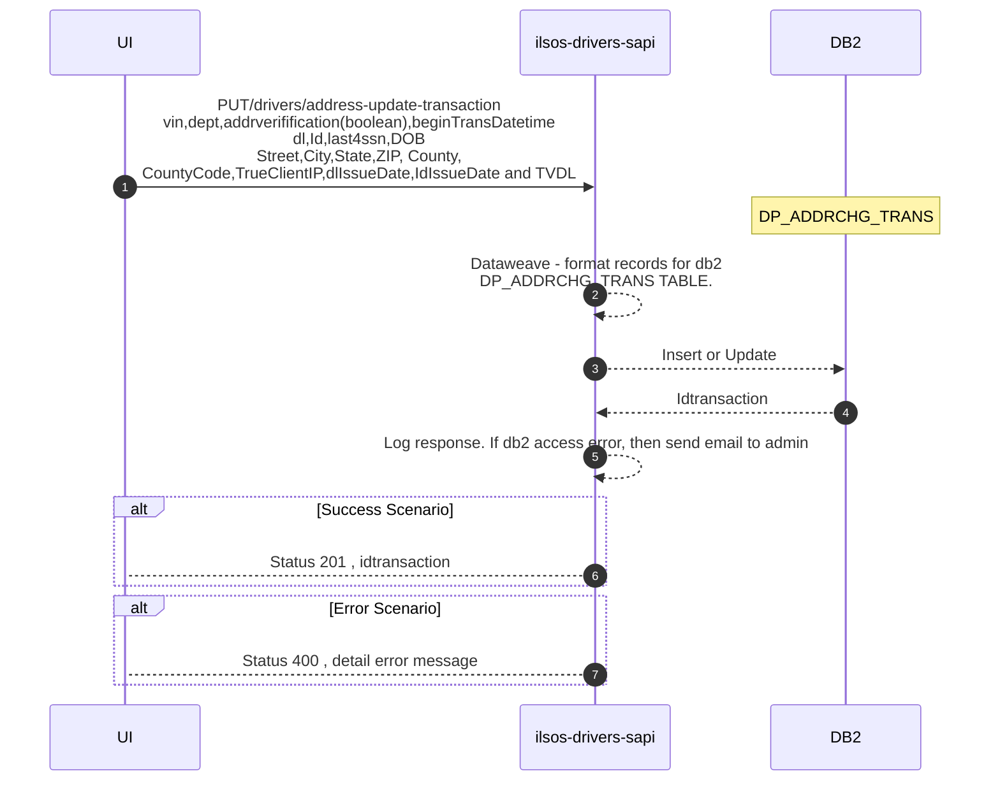

# ilsos-drivers-sapi

<br>

Drivers System API

## Table of contents
1. [Description](#description)
1. [Endpoints](#endpoints)
    1. [POST /v1/drivers/address-update](#post-v1driversaddress-update)
    1. [PUT /v1/drivers/transaction](#put-v1driversaddress-update-transaction)
    1. [GET /v1/drivers/id-validation](#get-v1driversid-validation)
    
    
           

## Description
The API provides the backend services for the Drivers Address Change business case. The next diagram shows the architecture


This service implements the next API specification: https://anypoint.mulesoft.com/exchange/0fa744b1-1284-46c5-b23c-0eb98ea787e3/ilsos-drivers-sapi/minor/1.0/

## Endpoints
The service provides the next endpoints:

### POST /v1/drivers/address-update
Updates the driver address.

The next diagram shows the business sequence of messages or events exchanged between the several backend systems.

```mermaid
sequenceDiagram
    autonumber
    participant ui as UI
    participant api as ilsos-drivers-sapi
    participant db2 as DB2
    participant mainframe as MainFrame

    ui->>api:POST/drivers/address-update <br>vin,dept,addrverifification(boolean),beginTransDatetime<br>dl,Id,last4ssn,DOB<br>Street,City,State,ZIP, County,<br>CountyCode,TrueClientIP,dlIssueDate,IdIssueDate and TVDL

    note over db2:DP_ADDRCHG_TRANS
    note over mainframe:CICS:dsf02gOut
    api-->>api:Dataweave - format records for db2<BR> DP_ADDRCHG_TRANS TABLE.
    api-->>db2:Update
    api-->>api:Log response. If db2 access error, then send email to admin
    alt Error Scenario 
        api-->ui: Status 400 , detail error message
    end
    api-->>api:Dataweave - format records for mainframe CICS(dsf02gOut)
    api-->>mainframe:Update driver record
    mainframe-->>api:Retrieve CICS code.
    api-->>api:Log response. If mainframe access error, then send email to admin
    alt Success Scenario 
        api-->ui: Status 200 
    end
    alt Error Scenario 
        api-->ui: Status 400 , error from CICS
    end
  ```


### GET /v1/drivers/id-validation
Get drivers id from mainframe.

```mermaid
sequenceDiagram
    autonumber
    participant ui as UI
    participant api as ilsos-drivers-sapi
    participant mainframe as MainFrame
    
    ui->>api:GET/drivers/id-validation <br>Input: dl,Id and last4ssn
    note over mainframe:CICS:dsf02gOut
    api-->>api:Dataweave - format records for mainframe CICS(dsf02gOut).
    api-->>mainframe:Validate input data.
    mainframe-->>api:Retrieve CICS code.
    api-->>api:Log response. If mainframe access error, then send email to admin
    alt Success Scenario 
        api-->ui: Status 200
    end
    alt Error Scenario 
        api-->ui: Status 400 
    end
```

### PUT /v1/drivers/address-update-transaction
Updates the information related with a transaction for the process of driver address update.


