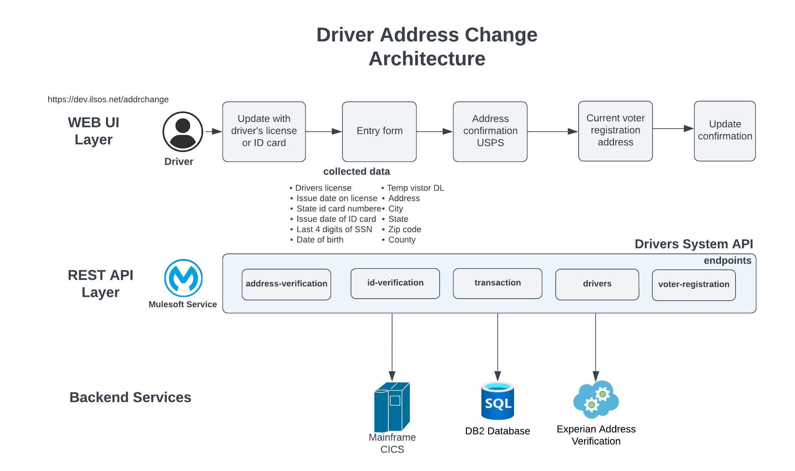

# ilsos-drivers-sapi

<br>

Drivers System API

## Table of contents
1. [Description](#description)
1. [Endpoints](#endpoints)
    1. [PATCH /v1/drivers](#patch-v1drivers)
    1. [GET /v1/drivers/address-verification](#get-v1driversaddress-verification)
    1. [GET /v1/drivers/id-verification](#get-v1driversid-verification)
    1. [POST /v1/drivers/transaction](#post-v1driverstransaction)
    1. [PUT /v1/drivers/transaction](#put-v1driverstransaction)
    1. [GET /v1/drivers/voter-registration](#get-v1driversvoter-registration)
       

## Description
The API provides the backend services for the Drivers Address Change business case. The next diagram shows the architecture



This service implements the next API specification: https://anypoint.mulesoft.com/exchange/0fa744b1-1284-46c5-b23c-0eb98ea787e3/ilsos-drivers-sapi/minor/1.0/

## Endpoints
The service provides the next endpoints:

### PATCH /v1/drivers
Updates the driver address.

The next diagram shows the business sequence of messages or events exchanged between the several backend systems.

```mermaid
sequenceDiagram
    autonumber
    participant ui as UI
    participant api as ilsos-drivers-sapi
    participant db2 as DB2
    participant mainframe as MainFrame

    ui->>api:PATCH/drivers <br>Input:idTransaction,dl,Id,last4ssn,DOB<br>Street,City,State,ZIP and County
    note over db2:DP_ADDRCHG_TRANS
    note over mainframe:CICS:dsf02gOut
    api-->>api:Dataweave - format records for db2<BR> DP_ADDRCHG_TRANS TABLE.
    api-->>db2:Update
    api-->>api:Log response. If db2 access error, then send email to admin
    alt Error Scenario 
        api-->ui: Status 400 , detail error message
    end
    api-->>api:Dataweave - format records for mainframe CICS(dsf02gOut)
    api-->>mainframe:Update driver record
    mainframe-->>api:Retrieve CICS code.
    api-->>api:Log response. If mainframe access error, then send email to admin
    alt Success Scenario 
        api-->ui: Status 200 
    end
    alt Error Scenario 
        api-->ui: Status 400 , error from CICS
    end
  ```

### GET /v1/drivers/address-verification
Verify the drivers address.

```mermaid
sequenceDiagram
    autonumber
    participant ui as UI
    participant api as ilsos-drivers-sapi
    participant qas as QAS

    ui->>api:GET/drivers/address-verification <br>Input: idTransaction,dl,Id,last4ssn,DOB<br>Street,City,State,ZIP and County
    api-->>api:Dataweave - format records for QAS.
    api-->>qas:Address validation.
    qas-->>api:Retrieve response.
    api-->>api:Log response. If QAS access error, then send email to admin
    alt Success Scenario 
        api-->ui: Status 200 ,response from QAS
    end
    alt Error Scenario 
        api-->ui: Status 400 , detail error message
    end
```

### GET /v1/drivers/id-verification
Get drivers id from mainframe.


### POST /v1/drivers/transaction
Updates the information related with a transaction for the process of driver address update.


### PUT /v1/drivers/transaction
Updates the information related with a transaction for the process of driver address update.


### GET /v1/drivers/voters-registration
Gets the voters registration from db2.


